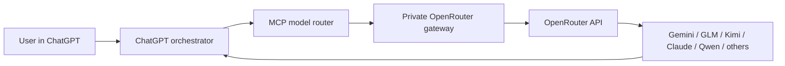

# Connect GPT to All Models with OpenRouter

[فارسی](README.fa.md) · [Agent instructions](docs/chatgpt-agent-instructions.md) · [Remote deployment](docs/remote-deployment.md) · [Security](SECURITY.md)

Use ChatGPT as an **orchestrator** for other AI models. A user can say “ask
Gemini,” “review this with GLM,” “send this task to Kimi,” or “compare Claude
and Qwen.” ChatGPT calls an MCP tool, this project routes the request through
OpenRouter, and the answer returns to the same conversation with the actual
`model_used` value.

Supported friendly aliases include Gemini, Gemini Flash, GLM, Kimi, Claude,
DeepSeek, and Qwen. Exact OpenRouter model slugs work too, and other short names
can be resolved against OpenRouter's live model catalog.

> This project does not turn one model into another. ChatGPT remains the host
> and orchestrator; OpenRouter provides access to external models that produce
> delegated answers. Every delegated request may incur OpenRouter charges.

## Architecture



The project has two small processes:

1. `server.py` — a credential-holding HTTP gateway. It binds to
   `127.0.0.1:3188` by default and talks to OpenRouter.
2. `mcp-server.mjs` — a stdio MCP server with three tools. It calls the private
   gateway and never needs to expose the OpenRouter key to ChatGPT.

## Features

- Delegate one task to any OpenRouter model.
- Compare two to four models in parallel.
- Resolve aliases from the live catalog, with optional pinned model overrides.
- Return `model_requested`, `model_resolved`, and confirmed `model_used`.
- Keep the OpenRouter key outside ChatGPT and MCP tool responses.
- Use locally through stdio, through an existing local Mac MCP bridge, or from
  ChatGPT web through a protected HTTPS MCP endpoint.
- Zero third-party Python dependencies; Node is used only for MCP.

## Requirements

- Python 3.10 or newer
- Node.js 20 or newer
- An [OpenRouter](https://openrouter.ai/) API key with suitable limits
- For ChatGPT web: an HTTPS endpoint and a supported ChatGPT plan/workspace
  configuration for custom apps/MCP

## Quick start

```bash
git clone https://github.com/Erfouni/connect-gpt-to-all-models-with-openrouter.git
cd connect-gpt-to-all-models-with-openrouter
cp .env.example .env
npm install
```

Edit `.env` and add your own key:

```dotenv
OPENROUTER_API_KEY=
```

Never paste that key into ChatGPT, a GPT instruction, an MCP configuration, a
tunnel command, a screenshot, or a Git commit.

Start the private gateway:

```bash
python3 server.py
```

In another terminal:

```bash
curl http://127.0.0.1:3188/health
npm test
```

An optional paid API smoke test:

```bash
curl -X POST http://127.0.0.1:3188/run \
  -H 'Content-Type: application/json' \
  -d '{"model":"gemini","prompt":"Reply with exactly: ROUTER_OK","max_tokens":64}'
```

## Operating modes

### 1. Local stdio MCP

Use this with an MCP client running on the same computer. Copy
`examples/mcp-client-config.json`, replace the absolute path, and add it to your
client's MCP configuration. Keep the gateway running, then the client starts
`mcp-server.mjs` over stdio.

```bash
npm run start:mcp
```

See [Local setup](docs/local-setup.md).

### 2. Existing Mac MCP bridge

If ChatGPT already has access to a trusted Mac MCP that includes an HTTP-fetch
tool, it can call the loopback gateway directly from that Mac:

```text
POST http://127.0.0.1:3188/run
```

This keeps both the key and gateway private. Use the bridge-mode instructions
in [Agent instructions](docs/chatgpt-agent-instructions.md). Do not expose a
general filesystem or shell MCP publicly just to reach this gateway.

### 3. Protected server / ChatGPT web

Convert the stdio MCP server to Streamable HTTP:

```bash
npm run start:mcp:http
```

It listens on port `3100`; the MCP path is:

```text
http://127.0.0.1:3100/mcp
```

Place this behind an authenticated HTTPS reverse proxy or secure tunnel. The
URL registered in ChatGPT must be a real HTTPS URL ending in `/mcp`, for example:

```text
https://mcp.example.com/mcp
```

It is **not** a local path such as `/Users/name/project/start.sh`. No ngrok
domain, authtoken, MCP token, API key, or personal path is included in this
repository. Create your own tunnel and credentials. See
[Remote deployment](docs/remote-deployment.md) before exposing anything.

## ChatGPT / Custom GPT setup

1. Get the local or protected remote MCP mode working first.
2. In ChatGPT, connect the custom app/MCP endpoint allowed by your plan or
   workspace. For server mode, enter `https://YOUR_DOMAIN/mcp`.
3. Create a Custom GPT and enable the connected app, if that option is available
   for your account/workspace.
4. Paste [the provided instructions](docs/chatgpt-agent-instructions.md) into the
   GPT instructions field.
5. Save it privately and test: “Ask Gemini to reply with `MODEL_OK`.”
6. Confirm that the response includes a real `model_used` value.

On ChatGPT web, a saved GPT can also be brought into an existing conversation
with `@GPT_NAME`, subject to current ChatGPT availability and workspace policy.

## MCP tools

| Tool | Purpose |
|---|---|
| `openrouter_list_models` | Search the current OpenRouter catalog |
| `openrouter_run_model` | Delegate one prompt to a requested model |
| `openrouter_compare_models` | Run the same prompt with 2–4 models |

## Gateway API

| Endpoint | Purpose |
|---|---|
| `GET /health` | Readiness and key-configuration status |
| `GET /models?search=...` | Search models |
| `POST /run` | Run one model |
| `POST /compare` | Compare models in parallel |
| `POST /refresh-models` | Refresh the cached catalog |

Example request:

```json
{
  "model": "kimi",
  "prompt": "Review the relevant conversation and list the three biggest risks.",
  "reasoning_effort": "high",
  "max_tokens": 4096
}
```

Exact slugs such as `provider/model-name` are passed through unchanged. Alias
defaults can be pinned in `.env`; otherwise the newest matching live catalog
entry is selected.

## Security essentials

- `.env` is ignored by Git. Only `.env.example` belongs in the repository.
- The gateway refuses a non-loopback bind unless `OPENROUTER_AGENT_TOKEN` is set.
- Do not expose port `3188` to the internet. Expose only the MCP layer, behind
  TLS and authentication.
- Do not publish a broad shell/filesystem MCP alongside this model router.
- Send external models only the context required for the delegated task.
- Set OpenRouter budget/rate limits and remember that `/compare` creates several
  independent billed requests.
- Rotate any credential that has ever appeared in chat, logs, screenshots, or
  Git history.

Read the full [security policy and deployment checklist](SECURITY.md).

## Automatic startup on macOS

After creating `.env`, install the generated LaunchAgent for the private Python
gateway:

```bash
chmod +x scripts/*.sh
./scripts/install-macos-launchagent.sh
```

The installer computes paths locally. No username or personal path is stored in
the repository.

## Tests

```bash
npm test
python3 -m unittest discover -s tests -p 'test_*.py'
python3 -m py_compile server.py
```

These tests do not call a paid model.

## License

[MIT](LICENSE)
